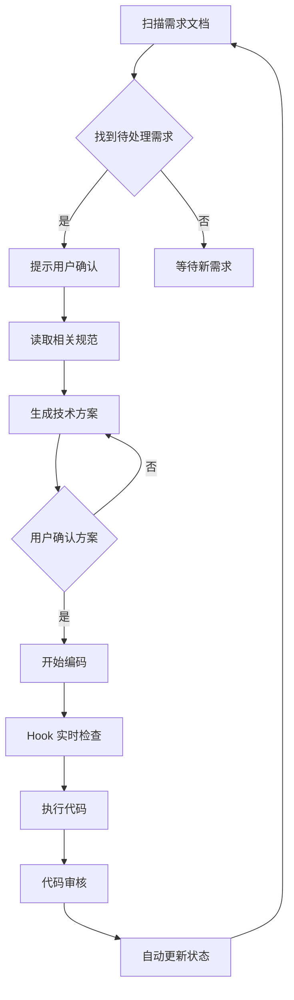

# CLAUDE.md

> 本项目的前端开发规范入口。AI 在生成、审查、修改任何前端代码时，必须遵循本文件及关联的规则体系。

## 项目概述

这是一个**小说在线阅读平台**，支持图片和文本小说（TXT格式）的上传及在线阅读，专注于 PC 端网页体验。

采用 **Harness 六层架构**实现 AI 驱动开发。

### 项目信息
- **项目名称**: 小说阅读平台
- **项目类型**: 全栈应用（Vue 3 前端 + Python FastAPI 后端）
- **创建日期**: 2026-06-25
- **当前阶段**: 开发中

## 技术栈

| 类别 | 技术 | 版本 | 说明 |
|------|------|------|------|
| 框架 | Vue 3 (Composition API + `<script setup>`) | ^3.5 | 强制使用 |
| 语言 | **TypeScript**（强制，禁止纯 JS） | - | 严格模式 |
| 构建 | Vite | ^8.0 | 快速构建 |
| UI 库 | **Element Plus**（按需导入） | - | 禁止其他 UI 库 |
| CSS 方案 | UnoCSS + SCSS (BEM 命名) | - | 原子化 + 自定义 |
| 状态管理 | Pinia (Setup Store 模式) | ^3.0 | 持久化存储 |
| 路由 | Vue Router (懒加载) | ^4.6 | 路由守卫 |
| HTTP | Axios (统一拦截器封装) | ^1.18 | 统一错误处理 |
| 国际化 | vue-i18n | ^11.4 | 多语言支持 |
| 工具库 | @vueuse/core | ^14.3 | 实用工具 |

## Harness 六层架构

```
┌─────────────────────────────────────────────┐
│  Layer 6: 验收层 (Acceptance)                │
│  - 自动化测试                                │
│  - 验收标准检查                              │
│  - 状态更新                                  │
├─────────────────────────────────────────────┤
│  Layer 5: 审核层 (Review)                    │
│  - 代码审核                                  │
│  - 规范检查                                  │
│  - 质量评估                                  │
├─────────────────────────────────────────────┤
│  Layer 4: 执行层 (Execution)                 │
│  - 代码生成                                  │
│  - 文件操作                                  │
│  - 构建部署                                  │
├─────────────────────────────────────────────┤
│  Layer 3: 方案层 (Solution)                  │
│  - 技术方案                                  │
│  - 架构设计                                  │
│  - 接口定义                                  │
├─────────────────────────────────────────────┤
│  Layer 2: 规范层 (Specification)             │
│  - 编码规范                                  │
│  - 架构规范                                  │
│  - Hook 规则                                 │
├─────────────────────────────────────────────┤
│  Layer 1: 需求层 (Requirement)               │
│  - 需求文档                                  │
│  - 验收标准                                  │
│  - 状态管理                                  │
└─────────────────────────────────────────────┘
```

## 文档结构

### 需求文档
- **路径**: `docs/requirements/`
- **索引**: `docs/requirements/index.md`
- **状态**: `pending` / `developing` / `done`
- **格式**: `feature-{功能名}.md`

### 规范文档
| 类型 | 路径 | 读取时机 | 说明 |
|------|------|----------|------|
| 核心规范 | `docs/specs/core/` | 启动时必读 | 编码规范、架构规范、Hook 规则 |
| 详细规范 | `docs/specs/detail/` | 按需读取 | 详细实现指南 |
| 模块规范 | `docs/specs/module/` | 开发特定模块时 | 模块特定规范 |

### 记忆文档
- **全局经验**: `docs/ai-memory/global/` - 跨模块的经验积累
- **模块经验**: `docs/ai-memory/module/` - 特定模块的经验

## 开发流程

### 启动阶段 (自动执行)

当开始新的开发会话时，**必须**按顺序执行：

1. **读取总索引**: `docs/index.md`
   - 了解项目整体结构
   - 获取文档导航信息

2. **读取需求索引**: `docs/requirements/index.md`
   - 了解当前需求状态
   - 获取待处理需求列表

3. **读取核心规范**: `docs/specs/core/`
   - `coding-standards.md` - 编码规范
   - `architecture.md` - 架构规范
   - `hook-rules.md` - Hook 检查规则

### 开发阶段



#### 详细步骤

1. **扫描需求文档**
   - 扫描 `docs/requirements/` 目录
   - 找到 `pending` 或 `developing` 状态的任务
   - 按优先级排序

2. **提示用户确认**
   - 显示需求详情
   - 等待用户确认开始开发

3. **读取相关规范**
   - 读取核心规范（必读）
   - 读取相关模块规范（按需）
   - 读取详细规范（按需）

4. **生成技术方案**
   - 分析需求
   - 设计技术方案
   - 定义接口
   - 规划实现步骤

5. **用户确认方案**
   - 展示技术方案
   - 等待用户确认
   - 根据反馈调整

6. **开始编码 (Hook 实时检查)**
   - 遵循编码规范
   - PreToolUse 检查
   - 代码生成

7. **执行代码**
   - PostToolUse 检查
   - ESLint 检查
   - TypeScript 检查

8. **代码审核**
   - 代码质量检查
   - 规范执行检查
   - 安全检查

9. **自动更新状态**
   - 更新需求状态
   - 记录开发日志
   - 更新记忆文档

## 核心规范 (P0 - 必须遵守)

### 编码规范
详见 `docs/specs/core/coding-standards.md`

**关键要点**:
- 使用 TypeScript 严格模式
- 遵循 Vue3 Composition API 最佳实践
- 统一命名规范
- 完善的错误处理
- 必要的代码注释

### 架构规范
详见 `docs/specs/core/architecture.md`

**关键要点**:
- Harness 六层架构
- 模块化设计
- 状态管理规范
- API 设计规范
- 进度跟踪规范

### Hook 检查规则
详见 `docs/specs/core/hook-rules.md`

**PreToolUse (工具调用前)**:
- 文件路径验证 (PRE-001)
- 代码规范预检查 (PRE-002)
- 依赖合法性检查 (PRE-003)
- 操作权限检查 (PRE-004)

**PostToolUse (工具调用后)**:
- ESLint 检查 (POST-001)
- TypeScript 类型检查 (POST-002)
- 测试覆盖检查 (POST-003)
- 文档同步检查 (POST-004)
- 安全漏洞检查 (POST-005)

## 验收标准

### 需求文档必须包含验收标准

每个需求文档 (`feature-*.md`) 必须包含明确的验收标准，格式如下：

```markdown
## 验收标准

- [ ] 功能点 1 描述
- [ ] 功能点 2 描述
- [ ] 功能点 3 描述
```

### 验收标准要求
- **具体**: 明确描述功能行为
- **可测试**: 可以通过测试验证
- **完整**: 覆盖所有功能点
- **可衡量**: 有明确的完成标准

### 验收流程
1. 功能实现完成后，自动检查验收标准
2. 所有验收标准通过后，更新需求状态为 `done`
3. 记录验收结果到开发日志

## 关键约束速查

以下规则**不可违反**：

- ✅ **必须使用 TypeScript**，所有 `.vue` 文件使用 `<script setup lang="ts">`
- ✅ **必须使用 Element Plus** 作为 UI 组件库，禁止引入其他 UI 库
- ✅ **必须使用 Composition API**（`ref`, `computed`, `watch` 等），禁止 Options API
- ✅ **必须使用 Pinia Setup Store** 模式（`defineStore('name', () => { ... })`）
- ✅ **必须使用 BEM 命名** 编写自定义样式
- ✅ 路由组件**必须懒加载**（`() => import(...)`）
- ✅ 所有异步操作**必须有错误处理**
- ❌ 禁止使用 `var`、`==`（使用 `const`/`let`、`===`）
- ❌ 禁止在模板中使用复杂表达式（抽取为 `computed`）
- ❌ 禁止直接操作 DOM（使用 Vue 响应式绑定）

## 当前状态

### 项目阶段
- **当前阶段**: 开发中
- **已完成需求**: 3 个
- **进行中**: 0 个
- **待处理**: 2 个

### 需求列表

| 需求编号 | 需求名称 | 状态 | 优先级 |
|----------|----------|------|--------|
| REQ-P1-001 | 用户注册与登录 | ✅ done | P0 |
| REQ-P1-002 | 小说上传与管理 | ✅ done | P0 |
| REQ-P2-001 | 书房页面 | ✅ done | P1 |
| REQ-P2-002 | 阅读器 | 📝 pending | P1 |
| REQ-P2-003 | 用户页面 | ✅ done | P1 |

### 已完成

#### 基础设施
- [x] Rules & Spec 体系建立
- [x] Harness 六层架构整合
- [x] 前端项目脚手架（Vue 3 + Vite + Element Plus + Pinia + Vue Router）
- [x] 后端项目搭建（FastAPI + SQLite + SQLModel）
- [x] 前端：main.js → main.ts 迁移 + App.vue 改造
- [x] 前端：Vite 代理配置 + @ 别名 + SCSS 支持
- [x] Commitlint + Husky — git commit 自动校验格式
- [x] Claude Code PreCommit Hook — 提交前自动 Prettier 格式化
- [x] GitHub PR 模板

#### 用户认证模块 (REQ-P1-001) ✅ done
- [x] 用户类型定义 `types/user.ts`（含 role、avatar）
- [x] API 服务层 `services/api.ts` + `services/auth.ts`
- [x] 用户 Store `stores/user.ts`（Pinia Setup Store + token 持久化）
- [x] 路由守卫 `router/guards.ts` + 路由更新
- [x] 登录页 `LoginView.vue`（两栏清新风格 + 绿色渐变 + 漂浮书本）
- [x] 注册页 `RegisterView.vue`（两栏风格 + 头像选择器 8 色）
- [x] 首页 `HomeView.vue`（登录/登出状态展示）
- [x] 后端认证接口：register、login、profile（含 JWT + avatar）
- [x] 后端 CORS + 配置模块
- [x] 密码加密：bcrypt 哈希存储

#### 小说上传模块 (REQ-P1-002) ✅ done（已重构）
- [x] 小说类型定义 `types/novel.ts`
- [x] 小说 API 服务 `services/novel.ts`
- [x] 小说 Store `stores/novel.ts`（职责分离：确认弹窗在视图层）
- [x] 上传页 `UploadView.vue`（统一顶部栏 + 卡片网格 + 加入书架）
- [x] 后端小说 API：upload、list、delete
- [x] 后端 Novel 模型 + Schema
- [x] 存储方案：本地文件系统 `uploads/novels/`
- [x] 敏感操作二次确认（删除小说含书名）
- [x] 上传后一键加入书架

#### 书房页面 (REQ-P2-001) ✅ done
- [x] 长按检测 composable `composables/useLongPress.ts`
- [x] 书房页 `LibraryView.vue`（书架网格 + 多选 + 分类 + 删除）
- [x] 顶部栏：返回按钮 + 标题 + 用户头像（点击跳转用户页）
- [x] 右侧分类栏（10% 宽度，支持新建分类，不同颜色区分）
- [x] 分类筛选（点击分类筛选书籍）
- [x] 长按/右键进入多选模式
- [x] 批量删除（二次确认，从书架移除）
- [x] 批量分类（弹窗选择，支持弹窗内新建）
- [x] 后端：Category 模型 + CRUD API
- [x] 后端：Bookshelf 模型 + 书架 API
- [x] 后端：Novel 模型新增 category_id
- [x] 后端：批量修改分类 API
- [x] 前端：Category Store + API 服务
- [x] 前端：Bookshelf Store + API 服务
- [x] 种子数据脚本 `seed.py`（test 用户 + 6 本假数据）

#### 用户页面 (REQ-P2-003) ✅ done
- [x] 用户页面 `UserView.vue`（头像 + 用户名 + 角色 + 统计 + 菜单）
- [x] 后端：User 模型新增 role 字段（admin / seed_member / member）
- [x] 后端：用户统计接口 `/api/auth/user/stats`
- [x] 后端：profile 接口返回 role + avatar
- [x] 前端：User 类型增加 role + avatar + 统计类型
- [x] 前端：auth API 增加 getUserStats
- [x] 书房页头像点击跳转用户页

### 待开始

#### Phase 2 - 功能扩展
- [ ] 前端：阅读器（ReaderView.vue）— 当前为占位页面 (REQ-P2-002)

#### Phase 3 - 功能完善
- [ ] 前端：国际化配置（vue-i18n）(REQ-P3-001)

#### 工具链
- [ ] 工具链：ESLint + Prettier + tsconfig.json

## 后端协作

后端项目在 `backend_project/`，基于 Python FastAPI + SQLite。
前端通过 `/api` 前缀调用后端接口，开发时 Vite 代理到 `http://localhost:8000`。

API 规范详见：`技术选型.md`

## 快速参考

### 常用命令
```bash
# 启动前端开发服务器
cd frontend_project && npm run dev

# 启动后端服务
cd backend_project && python -m uvicorn app.main:app --reload

# 构建前端
cd frontend_project && npm run build

# 代码检查
cd frontend_project && npm run lint

# 代码格式化
cd frontend_project && npm run format
```

### 重要文件
- **总索引**: `docs/index.md`
- **需求索引**: `docs/requirements/index.md`
- **核心规范**: `docs/specs/core/`
- **编码规范**: `docs/specs/core/coding-standards.md`
- **架构规范**: `docs/specs/core/architecture.md`
- **Hook 规则**: `docs/specs/core/hook-rules.md`

### 文档更新
- **最后更新**: 2026-06-27
- **更新内容**: 同步 Phase 2 全部需求（书房、用户页），登录/注册重构，头像系统

---

*本文件由 AI 维护，请勿手动编辑关键部分*
