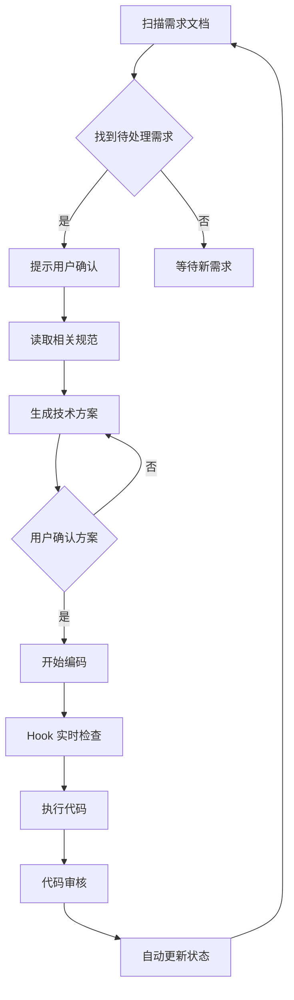

# AI 开发过程

> 本文档记录项目的开发过程、架构演进及后续使用方式。

## 一、项目演进

### 阶段一：Rules & Spec 体系（2026-06-20）

建立了三层 AI 开发规范体系：

| 层级 | 位置 | 数量 | 作用 |
|------|------|------|------|
| 主入口 | `CLAUDE.md` | 1个 | 自动加载，项目理念 + 技术栈 + 索引导航 |
| Rules | `.claude/rules/` | 11个文件 | 按领域拆分（01-11），每个 ≤104行 |
| Specs | `spec/` | 模板+示例 | 功能需求与验收标准 |

### 阶段二：Harness 六层架构（2026-06-25）⚠️ 已演进

整合 Harness 六层架构，建立标准化的 AI 驱动开发流程。**此架构已于 2026-06-30 演进为 AI Agent 原生六层架构**（见阶段三）。

<details>
<summary>旧 Harness 架构图（点击展开，仅供参考）</summary>

```
┌─────────────────────────────────────────────┐
│  Layer 6: 验收层 (Acceptance)                │
│  - 自动化测试                                │
│  - 验收标准检查                              │
│  - 状态更新                                  │
├─────────────────────────────────────────────┤
│  Layer 5: 审核层 (Review)                    │
│  - 代码审核                                  │
│  - 规范检查                                  │
│  - 质量评估                                  │
├─────────────────────────────────────────────┤
│  Layer 4: 执行层 (Execution)                 │
│  - 代码生成                                  │
│  - 文件操作                                  │
│  - 构建部署                                  │
├─────────────────────────────────────────────┤
│  Layer 3: 方案层 (Solution)                  │
│  - 技术方案                                  │
│  - 架构设计                                  │
│  - 接口定义                                  │
├─────────────────────────────────────────────┤
│  Layer 2: 规范层 (Specification)             │
│  - 编码规范                                  │
│  - 架构规范                                  │
│  - Hook 规则                                 │
├─────────────────────────────────────────────┤
│  Layer 1: 需求层 (Requirement)               │
│  - 需求文档                                  │
│  - 验收标准                                  │
│  - 状态管理                                  │
└─────────────────────────────────────────────┘
```

</details>

### 阶段三：AI Agent 原生六层架构（2026-06-30）

从流程导向的 Harness 流水线，演进为**多维度并行治理**的 AI Agent 运行时架构：

```
规范层 · 上下文层 · 约束层 · 记忆层 · 工具层 · 工作流层
```

六个维度在 AI 的每一次行为中同时生效。架构总纲：`docs/specs/core/ai-agent-architecture.md`

## 二、文档结构

### 当前结构

```
docs/
├── index.md                           # 总索引
├── requirements/
│   ├── index.md                       # 需求索引
│   ├── _template.md                   # 需求文档模板
│   ├── feature-auth-register.md       # 用户认证需求 ✅
│   └── feature-novel-upload.md        # 小说上传需求 ✅
└── specs/
    └── core/
        ├── coding-standards.md        # 编码规范（整合 5 个 rules）
        ├── architecture.md            # 架构规范（整合 6 个 rules）
        └── hook-rules.md              # Hook 规则（新建）
```

### 整合映射

| 原文件 | 目标文件 | 状态 |
|--------|----------|------|
| 01_project_structure.md | coding-standards.md | ✅ 已整合 |
| 02_vue3_components.md | coding-standards.md | ✅ 已整合 |
| 03_typescript.md | coding-standards.md | ✅ 已整合 |
| 04_state_management.md | architecture.md | ✅ 已整合 |
| 05_api_services.md | architecture.md | ✅ 已整合 |
| 06_styling.md | coding-standards.md | ✅ 已整合 |
| 07_routing.md | architecture.md | ✅ 已整合 |
| 08_error_handling.md | architecture.md | ✅ 已整合 |
| 09_git_conventions.md | coding-standards.md | ✅ 已整合 |
| 10_progress_tracking.md | architecture.md | ✅ 已整合 |
| 11_confirm_dialog.md | architecture.md | ✅ 已整合 |

## 三、开发流程

### 启动流程

新会话启动时，**必须**按顺序执行：

1. **读取总索引**: `docs/index.md`
2. **读取需求索引**: `docs/requirements/index.md`
3. **读取核心规范**: `docs/specs/core/`

### 开发流程



### 需求状态流转

```
pending → developing → done
```

## 四、Hook 检查规则

### PreToolUse（工具调用前）

- PRE-001: 文件路径验证
- PRE-002: 代码规范预检查
- PRE-003: 依赖合法性检查
- PRE-004: 操作权限检查

### PostToolUse（工具调用后）

- POST-001: ESLint 检查
- POST-002: TypeScript 类型检查
- POST-003: 测试覆盖检查
- POST-004: 文档同步检查
- POST-005: 安全漏洞检查

## 五、Memory 记忆系统

### 存储位置

```
docs/ai-memory/global/
├── MEMORY.md                    # 索引文件
├── 01_project-overview.md       # 项目概况
├── 02_ngrok-setup.md            # ngrok 配置
├── 03_current-progress.md       # 当前进度
└── 04_harness-architecture.md   # Harness 架构整合
```

### 使用方式

- **查看进度**: 读取 `docs/ai-memory/global/03_current-progress.md`
- **更新进度**: 每完成一个功能后，更新 checkbox 状态
- **新会话启动**: 按启动流程读取文档

## 六、AI Agent 六层架构搭建指南

> **本章节供 AI 参考，用于在其他新项目中搭建 AI Agent 原生六层架构。**
> 架构总纲参考：`docs/specs/core/ai-agent-architecture.md`（本项目的权威实现）

### 6.1 搭建步骤

#### 第一步：创建目录结构

```bash
# 创建 docs 目录结构
mkdir -p docs/{requirements,specs/{core,detail,module},ai-memory/{global,module}}
```

#### 第二步：创建总索引 `docs/index.md`

```markdown
# 📚 项目名称 - 项目总索引

> **最后更新**: YYYY-MM-DD
> **项目阶段**: 开发中

## 项目概述

简要描述项目背景和目标。

## 文档导航

### 📋 需求文档
- **路径**: `docs/requirements/`
- **索引**: [需求索引](requirements/index.md)

### 📐 规范文档
| 类型 | 路径 | 读取时机 | 说明 |
|------|------|----------|------|
| 核心规范 | `docs/specs/core/` | 启动时必读 | 编码规范、架构规范、Hook 规则 |
| 详细规范 | `docs/specs/detail/` | 按需读取 | 详细实现指南 |
| 模块规范 | `docs/specs/module/` | 开发特定模块时 | 模块特定规范 |

### 🧠 记忆文档
- **全局经验**: `docs/ai-memory/global/` - 跨模块的经验积累
- **模块经验**: `docs/ai-memory/module/` - 特定模块的经验

## 新会话启动流程

当开始新的开发会话时，**必须**按顺序执行：

1. **读取本文件**: `docs/index.md`
2. **读取需求索引**: `docs/requirements/index.md`
3. **读取核心规范**: `docs/specs/core/`

## 项目结构

```
项目根目录/
├── src/                    # 源代码
├── docs/                   # 📚 项目文档 (AI Agent 六层架构)
│   ├── index.md            # 本文件 - 总索引
│   ├── requirements/       # 需求文档
│   ├── specs/core/         # 规范层 + 约束层
│   │   ├── ai-agent-architecture.md   # 架构总纲
│   │   ├── coding-standards.md        # 编码规范
│   │   ├── architecture.md            # 架构规范
│   │   ├── constraint-layer.md        # 约束层定义
│   │   └── hook-rules.md              # Hook 规则
│   ├── specs/detail/       # 详细规范
│   ├── specs/module/       # 模块规范
│   └── ai-memory/          # 记忆层
│       ├── global/         # 全局经验
│       └── module/         # 模块经验
└── CLAUDE.md               # AI Agent 运行时入口
```

## AI Agent 六层架构

```
规范层 · 上下文层 · 约束层 · 记忆层 · 工具层 · 工作流层
```

> 六层并行生效，持续约束 AI 的每个行为。详见 `docs/specs/core/ai-agent-architecture.md`

---

*本文件由 AI 维护*
```

#### 第三步：创建需求索引 `docs/requirements/index.md`

```markdown
# 📋 需求索引

> **最后更新**: YYYY-MM-DD

## 需求状态说明

| 状态 | 说明 | 图标 |
|------|------|------|
| `pending` | 待处理 | 📝 |
| `developing` | 开发中 | 🚧 |
| `done` | 已完成 | ✅ |

## 版本阶段说明

| 阶段 | 前缀 | 说明 |
|------|------|------|
| Phase 1 | `P1` | 核心功能阶段 |
| Phase 2 | `P2` | 功能扩展阶段 |
| Phase 3 | `P3` | 功能完善阶段 |

## Phase 1 - 核心功能

| 编号 | 需求名称 | 状态 | 优先级 | 文件 |
|------|----------|------|--------|------|
| REQ-P1-001 | 示例需求 | 📝 pending | P0 | [phase1/feature-example.md](phase1/feature-example.md) |

## Phase 2 - 功能扩展

| 编号 | 需求名称 | 状态 | 优先级 | 文件 |
|------|----------|------|--------|------|
| REQ-P2-001 | 示例需求 | 📝 pending | P1 | [phase2/feature-example.md](phase2/feature-example.md) |

## 优先级说明

| 优先级 | 说明 |
|--------|------|
| P0 | 核心功能，必须实现 |
| P1 | 重要功能，应该实现 |
| P2 | 一般功能，可以实现 |
| P3 | 低优先级，可选实现 |

---

*本文件由 AI 维护*
```

#### 第四步：创建需求文档模板 `docs/requirements/_template.md`

```markdown
# REQ-{阶段}-{序号}: 需求名称

> **状态**: 📝 pending
> **优先级**: P0/P1/P2/P3
> **创建日期**: YYYY-MM-DD
> **最后更新**: YYYY-MM-DD

示例：REQ-P1-001, REQ-P2-001

## 1. 概述
简要描述需求背景和目标

## 2. 用户故事
- 作为 **[角色]**，我想要 **[功能]**，以便 **[价值]**

## 3. UI 布局
UI 示意图（ASCII 或图片链接）

## 4. 路由 & 页面
路由和页面配置

## 5. 组件树
组件层级结构

## 6. 数据流 & Store 设计
状态管理设计

## 7. API 契约
接口定义

## 8. 验收标准
- [ ] 验收点 1
- [ ] 验收点 2
- [ ] 验收点 3

## 9. 技术实现要点
- [ ] 实现点 1
- [ ] 实现点 2
- [ ] 实现点 3

## 10. 参考 & 备注
相关文档和备注

---

*本文件由 AI 维护*
```

#### 第五步：创建核心规范文件

**`docs/specs/core/coding-standards.md`**（编码规范）：

```markdown
# 编码规范 (Coding Standards)

> **优先级**: P0 - 必须遵守
> **最后更新**: YYYY-MM-DD

## 1. 项目结构 & 文件命名

### 目录结构
描述项目的目录结构

### 文件命名规范
| 文件类型 | 命名方式 | 示例 |
|----------|----------|------|
| 组件 | PascalCase | UserCard.vue |
| 工具 | kebab-case | api-client.ts |

## 2. 组件开发规范

### 核心原则
1. 使用 Composition API
2. Props 使用 TypeScript 接口定义
3. 事件处理函数使用 `handle` 前缀

### 组件标准模板
```vue
<template>
  <div class="component-name">
    <!-- 模板内容 -->
  </div>
</template>

<script setup lang="ts">
// 组件逻辑
</script>

<style scoped lang="scss">
.component-name {
  // BEM 命名
}
</style>
```

## 3. TypeScript 规范

### 核心约束
- 所有新代码必须使用 TypeScript
- 避免使用 any
- 使用 interface 定义对象形状

## 4. 样式规范

### 技术方案
- 原子化 CSS（UnoCSS/Tailwind）
- SCSS（BEM 命名）
- CSS 变量

## 5. Git 规范

### Commit 规范
```
<type>(<scope>): <subject>
```

Type: feat, fix, docs, style, refactor, perf, test, chore

---

*本文件由 AI 维护*
```

**`docs/specs/core/architecture.md`**（架构规范）：

```markdown
# 架构规范 (Architecture)

> **优先级**: P0 - 必须遵守
> **最后更新**: YYYY-MM-DD

## 1. 状态管理规范

### 核心原则
1. 使用 Setup Store 模式
2. Store 文件放在 `src/stores/`
3. 组件中使用 `storeToRefs` 解构

## 3. API 服务层规范

### 架构
```
services/
├── api.ts              # HTTP 客户端封装
├── auth.ts             # 认证相关 API
└── ...
```

## 4. 路由规范

### 路由配置标准
- 所有页面组件必须懒加载
- 需要认证的路由设置 meta.requiresAuth

## 5. 错误处理规范

### 全局错误处理
- Vue 全局错误捕获
- 未处理的 Promise 拒绝

## 6. 进度跟踪规范

### 核心原则
每次开发任务完成后，必须更新项目进度记录

### Memory 文件命名规范
使用数字前缀 + kebab-case：`01_project-overview.md`

---

*本文件由 AI 维护*
```

**`docs/specs/core/hook-rules.md`**（Hook 规则）：

```markdown
# Hook 检查规则 (Hook Rules)

> **优先级**: P0 - 必须遵守
> **最后更新**: YYYY-MM-DD

## PreToolUse（工具调用前）

### PRE-001: 文件路径验证
- 检查文件路径是否符合项目结构规范
- 检查文件命名是否符合命名规范

### PRE-002: 代码规范预检查
- 检查是否使用正确的语法（如 Composition API）
- 检查是否遵循命名规范

### PRE-003: 依赖合法性检查
- 检查引入的依赖是否在 package.json 中
- 检查是否引入了禁止的依赖

### PRE-004: 操作权限检查
- 检查是否执行了敏感操作
- 检查是否需要二次确认

## PostToolUse（工具调用后）

### POST-001: 代码质量检查
- ESLint 检查
- TypeScript 类型检查

### POST-002: 测试覆盖检查
- 检查新增代码是否有对应的测试
- 检查测试覆盖率

### POST-003: 文档同步检查
- 检查需求文档是否更新
- 检查验收标准是否勾选

---

*本文件由 AI 维护*
```

#### 第六步：创建 Memory 索引 `docs/ai-memory/global/MEMORY.md`

```markdown
# Memory Index - 全局经验

> **最后更新**: YYYY-MM-DD

## 文件列表

| 文件 | 名称 | 描述 |
|------|------|------|
| [01_project-overview.md](01_project-overview.md) | 项目概况 | 项目概况、技术栈、目录结构总览 |

## 使用说明

- **全局经验**: 跨模块的经验积累，适用于整个项目
- **模块经验**: 特定模块的经验，放在 `docs/ai-memory/module/` 目录

## 文件命名规范

- 使用数字前缀 + kebab-case：`01_project-overview.md`
- 数字按创建时间先后分配
- 创建后同步更新本索引文件

---

*本文件由 AI 维护*
```

#### 第七步：创建 Memory 文件 `docs/ai-memory/global/01_project-overview.md`

```markdown
# 项目概况

> **类型**: 全局经验
> **最后更新**: YYYY-MM-DD

## 项目概述

简要描述项目背景和目标。

## 目录结构

```
项目根目录/
├── src/                    # 源代码
├── docs/                   # 📚 项目文档 (AI Agent 六层架构)
│   ├── index.md            # 总索引
│   ├── requirements/       # 需求文档
│   ├── specs/core/         # 规范层 + 约束层
│   └── ai-memory/global/   # 记忆层
└── CLAUDE.md               # AI Agent 运行时入口
```

## 技术栈

| 类别 | 技术 | 版本 |
|------|------|------|
| 框架 | xxx | xxx |
| 语言 | xxx | xxx |

**Why:** 每次新对话需了解项目全貌，避免重复询问。

**How to apply:** 新会话启动时，先读取本文件了解项目概况。

**相关记忆**: [[02_current-progress]]
```

#### 第八步：更新 CLAUDE.md

在 CLAUDE.md 中按 AI Agent 六层架构组织（参考本项目 CLAUDE.md）：

```markdown
# CLAUDE.md — AI Agent 运行时配置

## ━━━ 上下文层：现在在做什么 ━━━
- 项目概述、技术栈、需求状态速览

## ━━━ 约束层：绝对不能做的事 ━━━
- 技术栈红线、代码红线、架构红线、安全红线、流程红线

## ━━━ 规范层：代码质量标准 ━━━
- 编码规范速查、架构规范速查

## ━━━ 工具层：能力边界 ━━━
- 可用工具清单、权限边界

## ━━━ 记忆层：过去学到的 ━━━
- 架构决策记录、技术债务、项目特有约定

## ━━━ 工作流层：按什么流程做 ━━━
- 会话启动/开发/修复/审查/结束 5 条 SOP
```

### 6.2 搭建检查清单

完成搭建后，检查以下内容：

- [ ] `docs/index.md` 存在且包含启动流程
- [ ] `docs/requirements/index.md` 存在且包含需求列表
- [ ] `docs/requirements/_template.md` 存在且包含需求模板
- [ ] `docs/specs/core/coding-standards.md` 存在且包含编码规范
- [ ] `docs/specs/core/architecture.md` 存在且包含架构规范
- [ ] `docs/specs/core/hook-rules.md` 存在且包含 Hook 规则
- [ ] `docs/ai-memory/global/MEMORY.md` 存在且包含索引
- [ ] `docs/ai-memory/global/01_project-overview.md` 存在且包含项目概况
- [ ] `docs/specs/core/ai-agent-architecture.md` 存在且包含六层架构总纲
- [ ] `docs/specs/core/constraint-layer.md` 存在且包含硬性红线
- [ ] `CLAUDE.md` 已按六层架构组织（上下文层/约束层/规范层/工具层/记忆层/工作流层）

### 6.3 使用流程

**新会话启动**：
1. 读取 `docs/index.md` 了解项目全貌
2. 读取 `docs/requirements/index.md` 了解需求状态
3. 读取 `docs/specs/core/constraint-layer.md` 加载硬性红线
4. 读取 `docs/ai-memory/global/03_current-progress.md` 了解进度
5. 读取 `docs/ai-memory/global/06_architecture-decisions.md` 回顾关键决策

**开发新功能**：
1. 复制 `docs/requirements/_template.md` 创建新需求文档
2. 填写需求概述、用户故事、验收标准等
3. 更新 `docs/requirements/index.md` 添加新需求
4. 按照 Hook 规则进行开发
5. 完成后更新需求状态为 `done`

**记录进度**：
1. 完成功能后，更新 `docs/ai-memory/global/03_current-progress.md`
2. 新建 memory 文件时，更新 `docs/ai-memory/global/MEMORY.md`

---

*本文件由 AI 维护*
